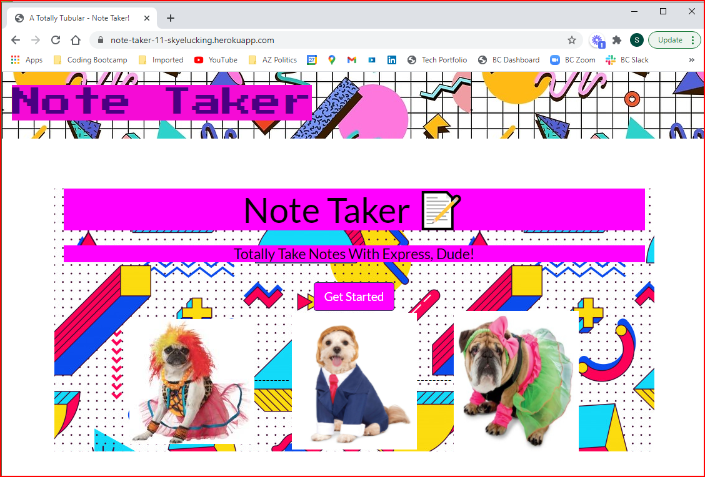
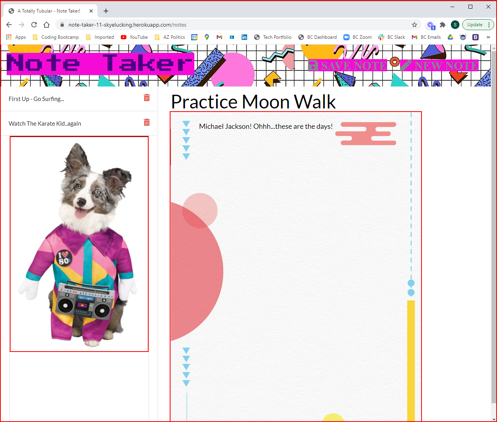
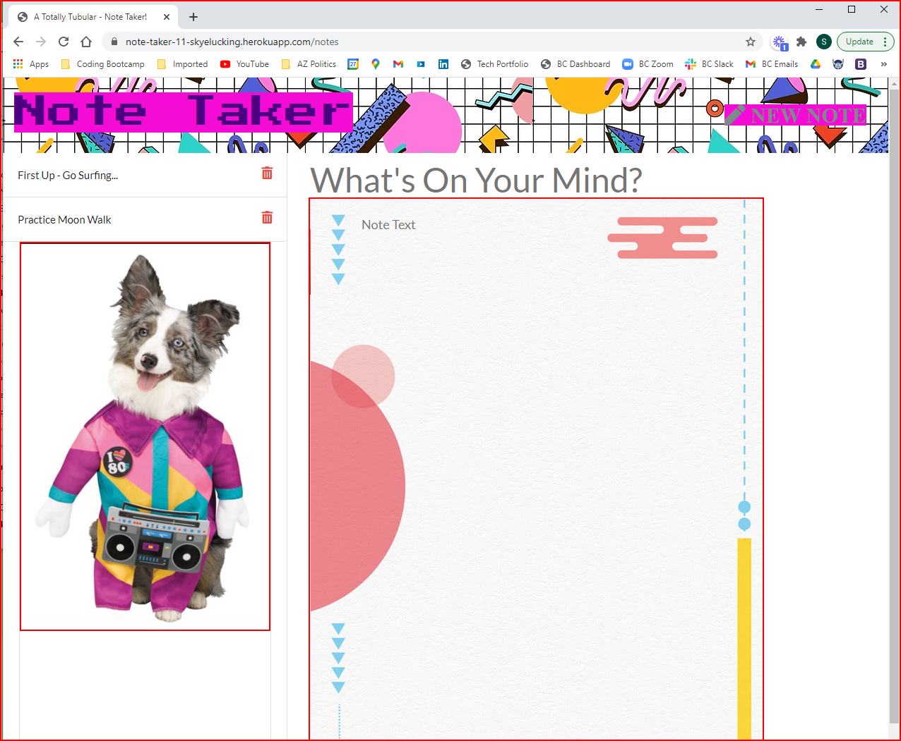

# Skye Lucking - Totally Tubular Note Taker!

<h1>Description of application</h1>
The "Totally Tubular Note Taker" Application allows users to create and save notes,to view previously saved notes, and delete previously saved notes in, like, a totally rad way!

 
 Enjoy!

 

<h1>Screenshots</h1>
Front Page Beckons the Note Taker... 
 
Click the button to get started

Previous Notes Persist and You Can Enter a New Note:  

And...you can delete a note as well...
 
Sorry "Karate Kid" we just don't have time... 

<h1>Link Heroku Deployed App</h1>
<a href="https://note-taker-11-skyelucking.herokuapp.com/">A Totally Tubular -Note Taker by Skye Lucking on Heroku!</a>

<h1>Link to GitHub Repo</h1>
<a href="https://github.com/skyelucking/11-Note-Taker">https://github.com/skyelucking/11-Note-Taker</a>

<h1>Now here is your joke...</h1>  
Q: Why would someone want to have a DeLorean as a second car? 

 
 
 
<em>– A: So they could drive it from time to time!</em>
